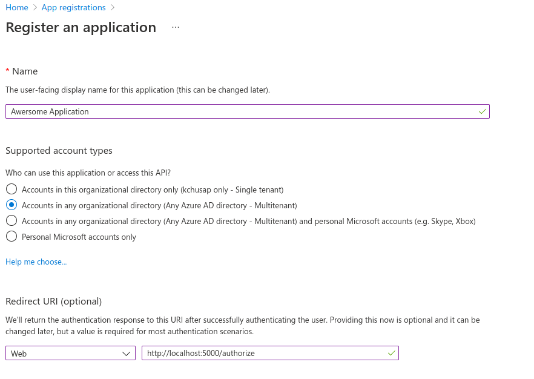
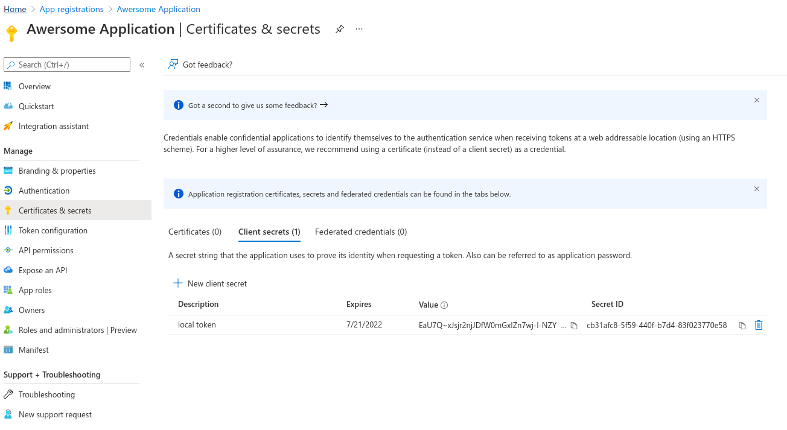

# mngt - Management Platform

The deployed versiobn can be visited at [https://mngt.cots-conf.page/](https://mngt.cots-conf.page/)

## Locally Run

If you want to run the project locally, there are couple steps to set it up. The major requirements are

1. Python 3.10 which can be installed from [https://www.python.org/](https://www.python.org/)
2. Register an application on [Azure Developer Portal](https://portal.azure.com) this will allow
   you to log in with OHIO university account.

### Register for an application in Azure portal

Visit [https://portal.azure.com](https://portal.azure.com) and login with a Microsoft account.
Search for `app registration`, and create new registration.

Name your application and select `Any Azure AD directory - Multitenant` option. For the redirect URL,
add `http://localhost:5000/authorize` for a web platform.



On the side bar, click `Certificate & secrets`, then add new client secret. Name your token and select
the expiration date. Copy the Value of the secret aside. We will add this to the `.env` file later.



Once the secret value is copied, go back to overview and copy the `application ID` aside as well.

### Install Python packages

You can install the `mngt` package

```console
# At root directory of the project.
python -m pip install .
```

or install the required packages directly with `requirements.txt`

```console
python -m pip install -r requirements.txt
```

### Intialize database

First we create tables by running the following command.

```console
FLASK_APP=mngt.wsgi:app flask init-db
```

We can then import data for COTS 2021 using the following command.

```console
FLASK_APP=mngt.wsgi:app flask import-cots2021 ./mngt/tests/cots2021-proposals.xlsx
```

### Create `.env` file

Make a copy of `env.sample` and rename it to `.env`. Then fill in the value for
`AZURE_CLIENT_ID` and `AZURE_CLIENT_SECRET` using the value of set aside from the previous step.


### Running the server

Finally, you can run the server using the following command.

```console
FLASK_APP=mngt.wsgi:app flask run
```

You can now visit `http://localhost:5000`.

## Deployment

You will need to obtain the `AZURE_CLIENT_ID` and `AZURE_CLIENT_SECRET`. Please visit the above section on how to get them.

### Requirements

- Python 3.10
- Nginx

### Steps

Minimal Nginx configuration. This assumes that Cloudflare is providing the certificate.

```plain
# /etc/nginx/sites-available/mngt
server {
    listen 80;
    server_name mngt.cots-conf.page;

    location / {
        proxy_pass http://localhost:5000;
        proxy_set_header X-Forwarded-Proto https;
        proxy_set_header X-Real-IP $remote_addr;
        proxy_set_header X-Forwarded-For $proxy_add_x_forwarded_for;
        proxy_set_header Host $http_host;
        proxy_redirect off;
    }
}
```

Deployment steps.

```console
apt update

# install web server
apt install nginx

# install python and pyenv
sudo apt-get update; sudo apt-get install make build-essential libssl-dev zlib1g-dev \
libbz2-dev libreadline-dev libsqlite3-dev wget curl llvm \
libncursesw5-dev xz-utils tk-dev libxml2-dev libxmlsec1-dev libffi-dev liblzma-dev

curl https://pyenv.run | bash
pyenv virtualenv 3.10.0 py3100

# clone the project and install python requirements
git clone https://github.com/cots-conf/mngt
cd mngt
pyenv local py3100
pip install -r requirements.txt

# install the service file and start the service
cp systemd/mngt.service /etc/systemd/system
systemctl daemon-reload
systemctl start mngt

# Create nginx configuration using the sample config listed before


# Restart/reload nginx
ln -s /etc/nginx/sites-available/mngt /etc/nginx/sites-enabled
systemctl restart nginx
```

Create tables and seed/import the data

```console
# initialize database
FLASK_APP=mngt.wsgi:app flask init-db

# seed or import data.
FLASK_APP=mngt.wsgi:app flask seed-db
FLASK_APP=mngt.wsgi:app flask import-cots2021 ./path/to/excel/file
```
